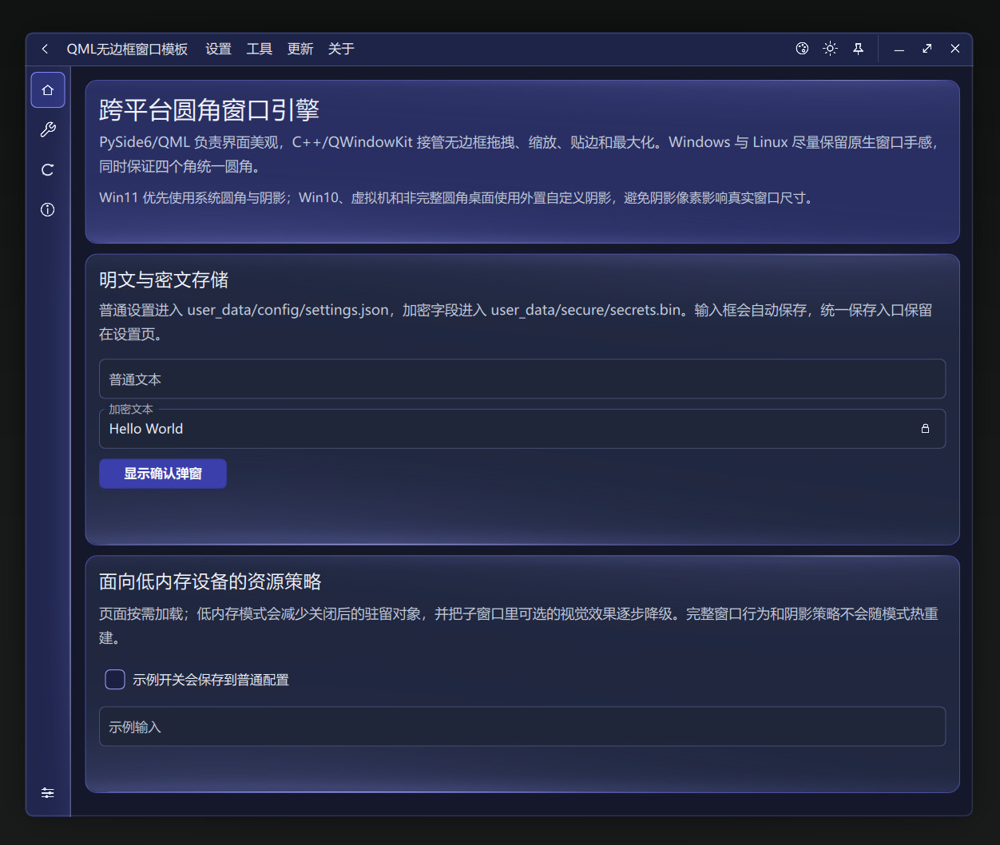
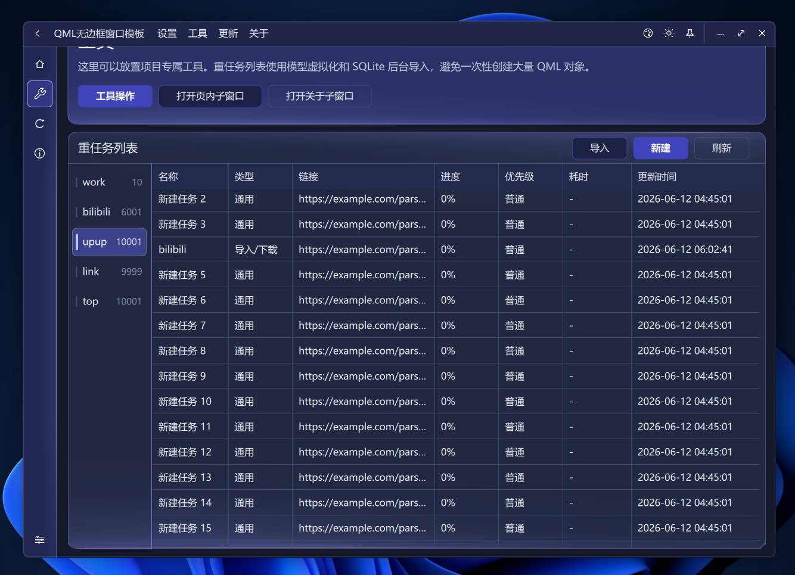
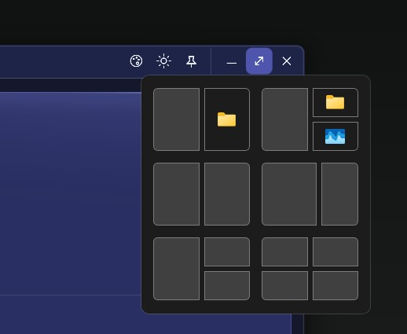
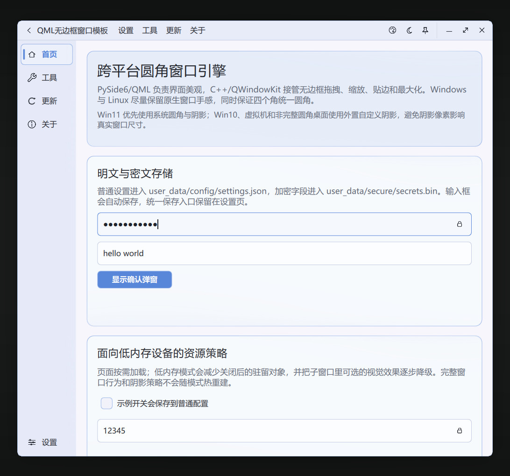
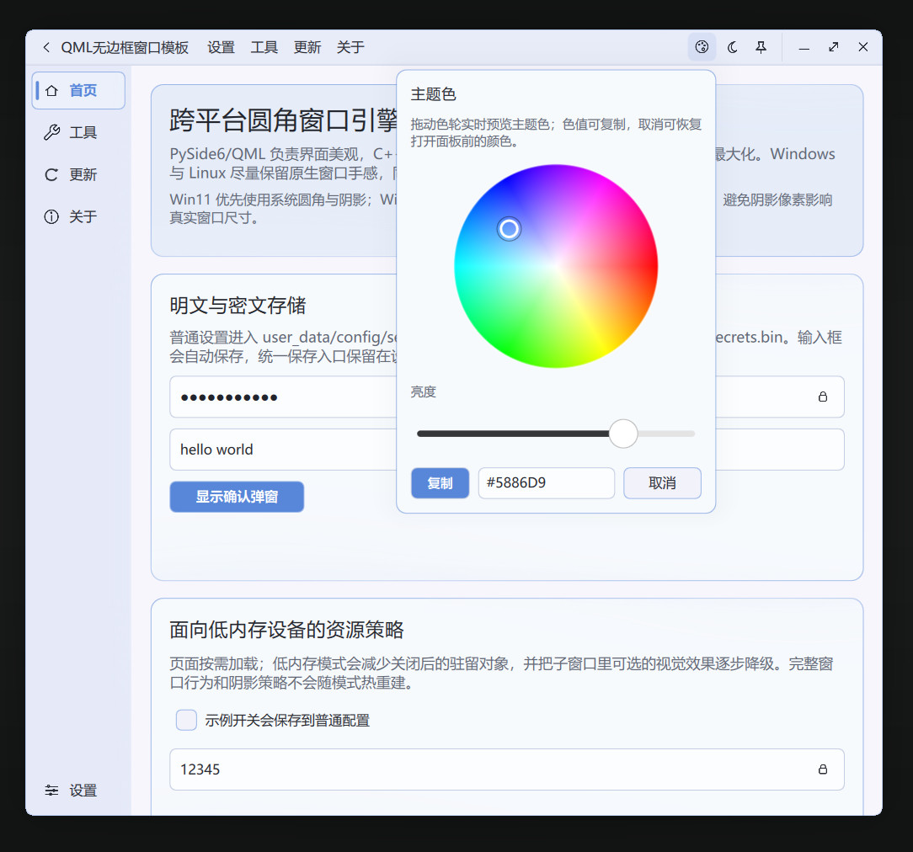
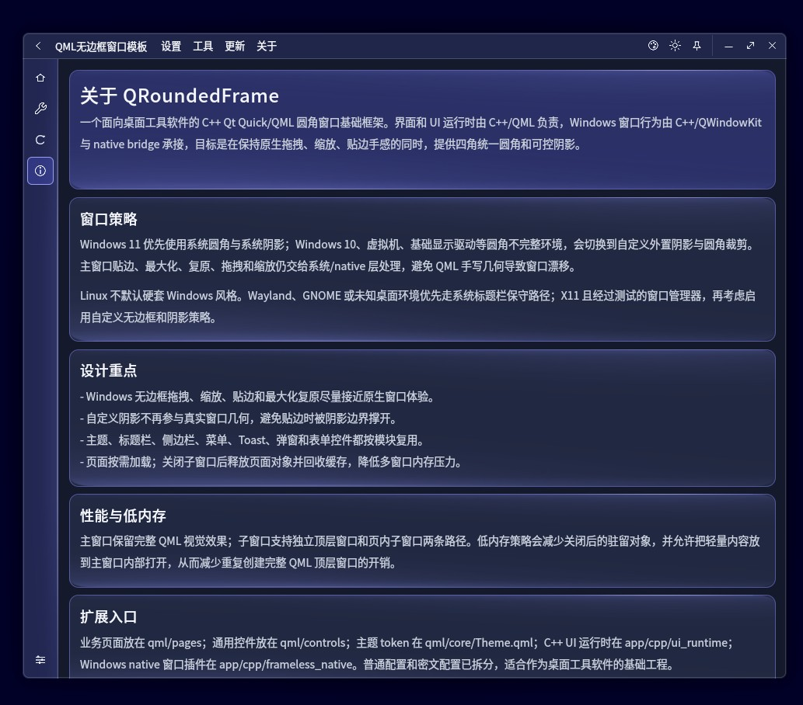
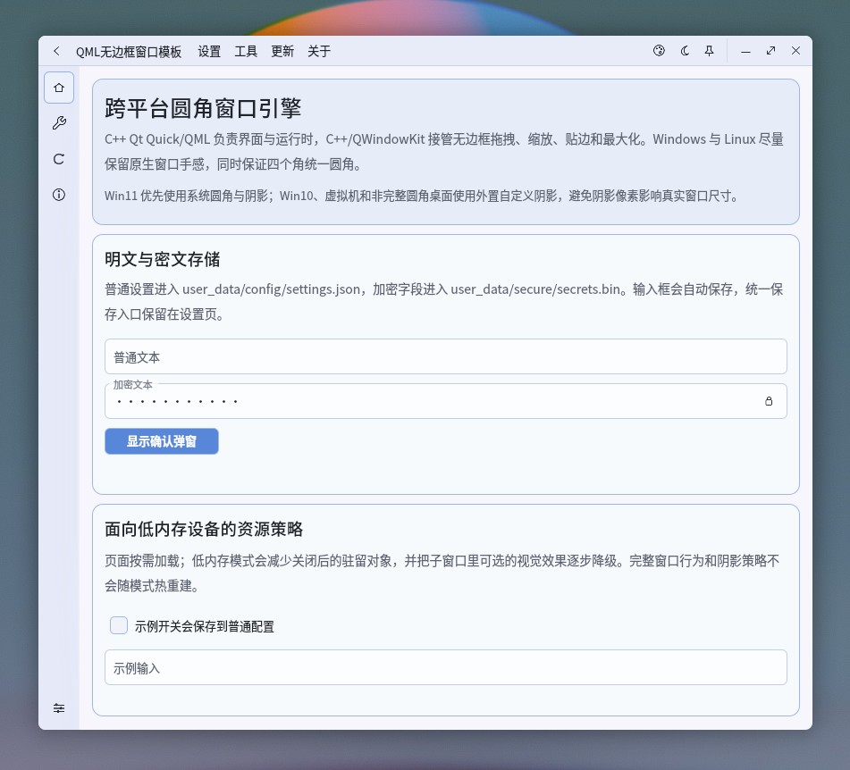
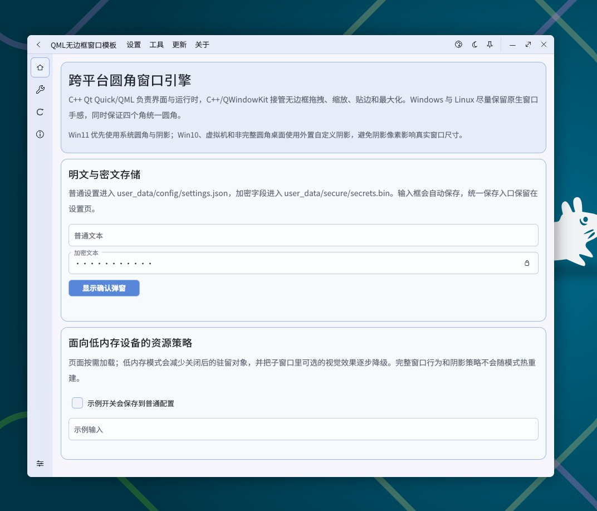
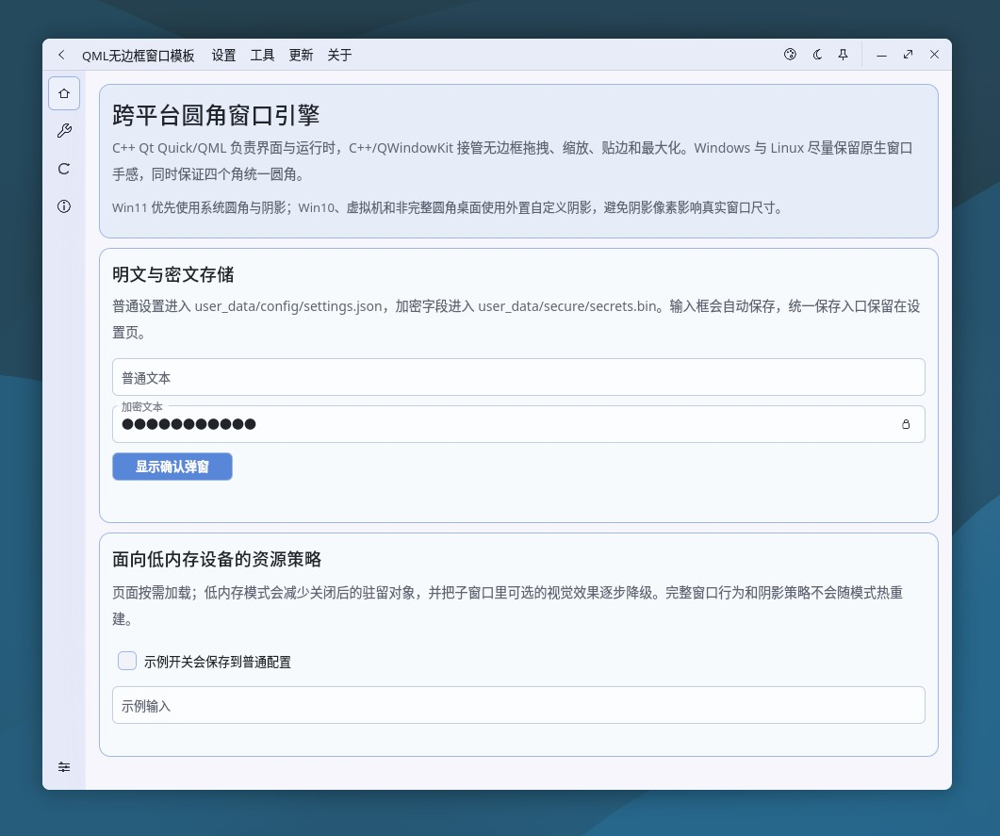

# QRoundedFrame

一个 C++ Qt Quick + QML 跨平台圆角无边框窗口框架。

C++ 负责 Qt Quick/QML 启动、窗口壳、主题、设置、托盘、任务列表模型和内存采样；QML 负责界面表现；Python 只作为开发期启动器和业务 worker 示例使用。

项目目标不是只在 Windows 11 上显示圆角窗口，而是同时处理 Windows 10、虚拟机、Linux X11 桌面环境差异下的圆角、阴影和原生窗口行为。窗口拖拽、缩放、贴边、最大化、复原和托盘行为尽量保持系统原生体验，界面仍保留 QML 的现代观感。

## 界面预览

| 夜间样式 |
| --- |
|  |

| 更多控件 |
| --- |
|  |

| 列表样式 |
| --- |
|   |

| 页内子窗口 | 原生贴边预览 |
| --- | --- |
|  |  |

| 日间样式 | 调色盘 |
| --- | --- |
|  |  |

| 日间页内子窗口 | 子窗口最小化 |
| --- | --- |
|  |  |

| Cinnamon X11 / Muffin | GNOME X11 / Mutter |
| --- | --- |
|  |  |

| XFCE X11 / Xfwm4 | KDE Plasma X11 / KWin |
| --- | --- |
|  |  |

## 主要特点

- **跨平台窗口壳**：主窗口、子窗口、标题栏、页面、托盘、设置、主题和弹窗按模块拆分，可作为桌面软件基础壳复用。
- **四角圆角策略**：Windows 11 正常环境优先使用系统圆角和系统阴影；Windows 10、虚拟机、Basic/Remote Display，以及 Linux 中没有完整四角圆角的环境，使用自定义圆角和外置阴影策略。
- **原生窗口行为优先**：拖拽、边缘缩放、左右半屏、顶部最大化、最大化复原和系统按钮命中区域尽量交给 C++ native/QWindowKit 管理，避免 QML 几何补丁接管高频窗口行为。
- **低内存策略**：页面按需加载，子窗口关闭后释放对象和缓存；设置页支持自动清理热缓存，尽量控制长期运行后的内存增长。

## 支持环境

### Windows

| 系统/环境 | 窗口策略 |
| --- | --- |
| Windows 11 正常显示环境 | 系统圆角 + 系统阴影 |
| Windows 10 | 自定义圆角 + 外置 PNG 阴影 helper |
| Windows 11 虚拟机 / Basic Display / Remote Display | 自定义圆角 + 外置 PNG 阴影 helper |

### Linux

Linux 默认按窗口管理器和会话类型判断，不按发行版名称判断。当前白名单来自代码中的 `LINUX_CUSTOM_CHROME_WM_ALLOWLIST` 和 C++ runtime 同步列表：

| 白名单名称 | 已验证环境 | 备注 |
| --- | --- | --- |
| `gnome` | GNOME on Xorg / Mutter | 启用 Linux CSD/custom shadow 路线 |
| `cinnamon` | Cinnamon on X11 / Muffin | 启用 Linux CSD/custom shadow 路线 |
| `mate` | MATE on X11 / Marco | 启用 Linux CSD/custom shadow 路线 |
| `xfce` | XFCE on X11 / Xfwm4 | 启用 Linux CSD/custom shadow 路线 |
| `kde` | KDE Plasma on X11 / KWin | 启用 Linux CSD/custom shadow 路线 |
| `plasma` | KDE Plasma 会话别名 | 部分发行版使用该 session token |

Linux Wayland 或未知桌面环境，需要验证，再加入白名单。

## 内存策略

项目按接近用户实际感知的私有内存口径展示占用。页面按需加载，子窗口关闭后释放对象和缓存；设置页支持自动清理热缓存。不同渲染后端、桌面环境、DPI、显卡驱动和系统任务管理器口径都会影响显示数值。

- win 虚拟机里主窗口运行内存占约 65MB;
- linux 虚拟机各桌面环境主窗口运行内存占约 43MB;
- win 原生系统上运行占约 82MB（因为后端渲染模式不同）；
- 切换分页、打开组件、切换主题等操作，虚拟机内只增长 10MB 左右，原生系统则增长 20MB 左右。
- 后续会自动释放回收内存占用量，超过本软件设置页里的规定限制都会自动清理热缓存。

## 运行

开发期从根目录运行：

```bash
python3 run.py
```

Windows 环境也可以使用：

```bat
python run.py
```

`run.py` 会启动 C++ UI 主程序；如果主程序不存在，会先调用对应平台构建脚本。

Windows 默认启动产物：

```text
build/cpp_ui/bin/QRoundedFrame.exe
```

Linux 默认启动产物：

```text
build/cpp_ui/linux/bin/QRoundedFrame
```

## 打包

打包 Linux/Window ：

```bash
python3 scripts/package_app.py
```

Windows 环境也可以使用 `python scripts\package_app.py`。

默认输出：

```text
dist/QRoundedFrame/QRoundedFrame.exe
```

打包脚本会构建 C++ UI，并复制 QML、资源、Qt runtime 和 `app/prebuilt` 里的 FramelessNative 插件到 `dist/QRoundedFrame/`。更多脚本说明见 [scripts/README.md](scripts/README.md)。

## 目录

```text
run.py                         开发期启动入口，负责启动 C++ UI 程序
app/cpp_ui_launcher.py         C++ UI 构建/启动辅助
app/cpp/ui_runtime/            C++ Qt Quick UI 主程序
app/cpp/frameless_native/      FramelessNative QML native 插件源码
app/prebuilt/                  已编译 FramelessNative 插件
app/workers/                   Python 业务 worker 示例
app/window_policy.py           平台窗口策略判断
qml/                           QML 界面
resources/                     图标、图片、阴影和 README 截图资源
scripts/                       项目级检查、探测和打包脚本
third_party/qwindowkit/        vendored QWindowKit
```

## Native 预编译插件

当前仓库保留 Qt 6.11 对应的 FramelessNative 预编译插件：

```text
app/prebuilt/win-x64-qt6.11-system/qml/FramelessNative
app/prebuilt/win-x64-qt6.11-custom/qml/FramelessNative
app/prebuilt/linux-x64-qt6.11-system/qml/FramelessNative
app/prebuilt/linux-x64-qt6.11-custom/qml/FramelessNative
```

- `system`：可信系统圆角/阴影路径。
- `custom`：Windows 10、虚拟机、Linux 已验证 X11 桌面等需要自定义圆角和外置阴影的路径。

重新编译入口见 [scripts/README.md](scripts/README.md)。

## 架构原则

- QML 只做界面表现，不接管高频窗口行为。
- C++ UI runtime 处理 UI 运行时状态、窗口壳、托盘、模型、内存采样等主进程能力。
- Python 不再常驻 UI 进程；需要业务逻辑时走 `app/workers/`，通过 JSON stdin/stdout、SQLite、文件队列或 IPC 通信。

## QWindowKit 来源

native 无边框行为基于 QWindowKit：

https://github.com/stdware/qwindowkit

本仓库暂时把 QWindowKit 源码放在 `third_party/qwindowkit/`，方便普通用户 clone 后直接编译，不需要额外初始化 submodule。后续升级 QWindowKit 时，需要重新核对本项目针对拖拽、缩放、贴边、阴影和 Linux 桌面环境差异的本地适配。

## Star

`references/` 中的图片来自网络截图，只作为后续样式改进参考。

软件样式、窗口策略、主题美化等均为自行设计，因为在不断找美观和内存占用量的平衡点，所以美化方面没做太复杂。
如果这个项目对你有启发或者喜欢的话，点个 Star 吧~
