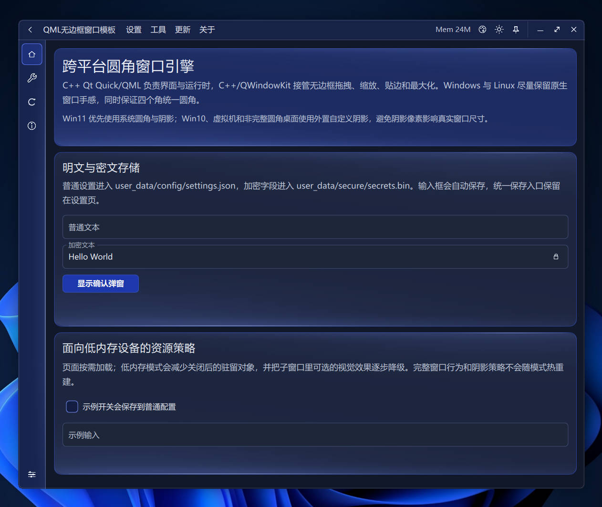
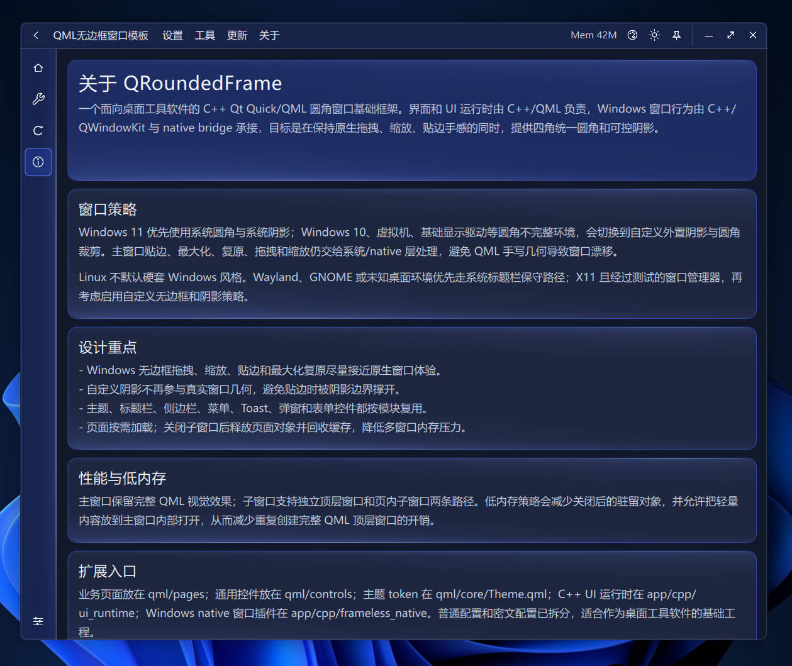
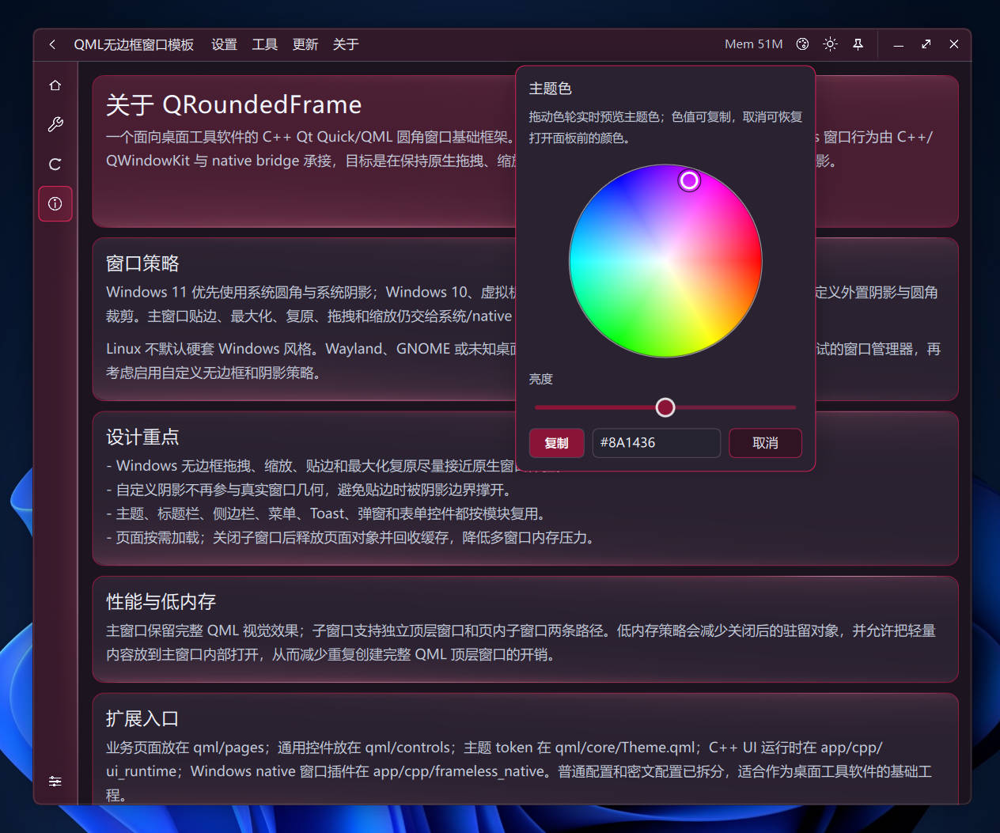
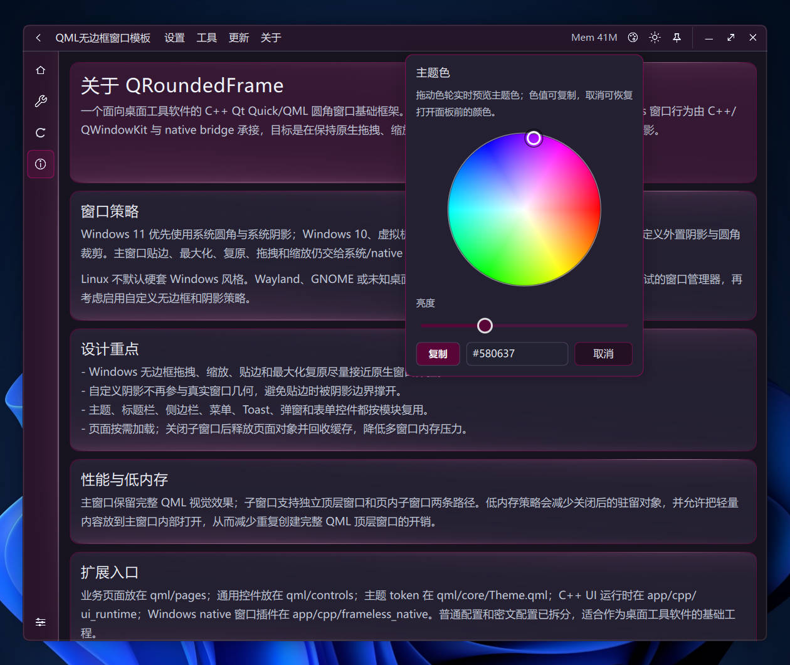

# QRoundedFrame

一个 C++ Qt Quick + QML 跨平台圆角无边框窗口框架。

C++ 负责 Qt Quick/QML 启动、窗口壳、主题、设置、托盘、任务列表模型和内存采样；QML 负责界面表现；Python 只作为开发期启动器和业务 worker 示例使用。

项目目标：不是只在 Windows 11 上显示圆角窗口，而是同时处理 Windows 10、虚拟机、Linux X11 桌面环境差异下的圆角、阴影和原生窗口行为。窗口拖拽、缩放、贴边、最大化、复原和托盘行为尽量保持系统原生体验，界面仍保留 QML 的现代观感。

## 界面预览

夜间样式：



更多控件：


列表样式：


关于页：



调色盘1：



调色盘2：



| 页内子窗口 | 原生贴边预览 |
| --- | --- |
|  |  |

| 日间样式 | 调色盘 |
| --- | --- |
|  |  |

| 日间页内子窗口 | 子窗口最小化 |
| --- | --- |
|  |  |

| Cinnamon X11 / Muffin | GNOME X11 / Mutter |
| --- | --- |
|  |  |

| XFCE X11 / Xfwm4 | KDE Plasma X11 / KWin |
| --- | --- |
|  |  |

## 主要特点

- **四角圆角策略**：Windows 11 正常环境优先使用系统圆角和系统阴影；Windows 10、虚拟机、Basic/Remote Display，以及 Linux 中没有完整四角圆角的环境，使用自定义圆角和外置阴影策略。
- **原生窗口行为优先**：拖拽、边缘缩放、左右半屏、顶部最大化、最大化复原和系统按钮命中区域尽量交给 C++ native/QWindowKit 管理，避免 QML 几何补丁接管高频窗口行为。
- **两类子窗口**：独立子窗口用于真正需要顶层窗口的页面；页内子窗口运行在主窗口内部，适合设置面板、临时表单和轻量工具页，能减少额外顶层窗口带来的内存开销。
- **低内存策略**：页面按需加载，列表按可见区域虚拟化，子窗口关闭后释放对象和缓存；设置页支持自动清理热缓存，尽量控制长期运行后的内存增长。

## 支持环境

### Windows

| 系统/环境 | 窗口策略 |
| --- | --- |
| Windows 11 正常显示环境 | 系统圆角 + 系统阴影 |
| Windows 10 | 自定义圆角 + 外置 PNG 阴影 helper |
| Windows 11 虚拟机 / Basic Display / Remote Display | 自定义圆角 + 外置 PNG 阴影 helper |

### Linux

Linux 默认按窗口管理器和会话类型判断，不按发行版名称判断。当前白名单来自代码中的 `LINUX_CUSTOM_CHROME_WM_ALLOWLIST` 和 C++ runtime 同步列表：

| 白名单名称 | 已验证环境 | 备注 |
| --- | --- | --- |
| `gnome` | GNOME on Xorg / Mutter | 启用 Linux CSD/custom shadow 路线 |
| `cinnamon` | Cinnamon on X11 / Muffin | 启用 Linux CSD/custom shadow 路线 |
| `mate` | MATE on X11 / Marco | 启用 Linux CSD/custom shadow 路线 |
| `xfce` | XFCE on X11 / Xfwm4 | 启用 Linux CSD/custom shadow 路线 |
| `kde` | KDE Plasma on X11 / KWin | 启用 Linux CSD/custom shadow 路线 |
| `plasma` | KDE Plasma 会话别名 | 部分发行版使用该 session token |

Linux Wayland 或未知桌面环境，需要验证，再加入白名单。

## 架构原则

- QML 只做界面表现，不接管高频窗口行为。
- C++ UI runtime 处理 UI 运行时状态、窗口壳、托盘、模型、内存采样等主进程能力。
- Python 不再常驻 UI 进程；需要业务逻辑时走 `app/workers/`，通过 JSON stdin/stdout、SQLite、文件队列或 IPC 通信，把 Python 当成独立 worker 调用。

## 内存策略

页面用到了才加载，关了子窗口就清掉对象和缓存。设置页也能自动清理缓存。不同渲染后端、桌面环境、DP I、显卡驱动和系统任务管理器统计口径不一样，看到的内存数值会有差别。

- Win 虚拟机里主窗口跑起来大约 65MB
- Linux 虚拟机各桌面环境主窗口大约 43MB（KDE 非 100% DPR 下大约 89MB，因为开了 OpenGL 后端渲染）
- Win 原生系统上大约 84MB（渲染后端模式不同导致的）
- 来回切页面、开组件、换主题这些操作，虚拟机里只涨 10MB 左右，原生系统涨 20MB 左右
- 超了设置页里的内存上限会自动清理缓存，把内存降下来

列表数据走 C++ 模型 + SQLite 存，QML 只渲染看得见的那几行。普通模式多留点缓存保证切页流畅，低内存模式就少缓存。真要处理上万条数据，建议用工具页的导入和批量功能，别一次性把上万行摊成普通 QML Item 来渲染，扛不住的。

独立顶层子窗口会额外开一套窗口、场景和缓存。如果只是临时配置或局部预览，优先用页内子窗口，它复用主窗口场景，内存省不少，也省得频繁创建销毁顶层窗口。

## 运行

开发期从根目录运行：

```bash
python3 run.py
```

Windows 环境也可以使用：

```bat
python run.py
```

`run.py` 会启动 C++ UI 主程序；如果主程序不存在，会先调用对应平台构建脚本。

Windows 默认启动产物：

```text
build/cpp_ui/bin/QRoundedFrame.exe
```

Linux 默认启动产物：

```text
build/cpp_ui/linux/bin/QRoundedFrame
```

## 打包

打包 Linux/Window ：

```bash
python3 scripts/package_app.py
```

Windows 环境也可以使用 `python scripts\package_app.py`。

默认输出：

```text
dist/QRoundedFrame/QRoundedFrame.exe
```

打包脚本会构建 C++ UI，并复制 QML、资源、Qt runtime 和 `app/prebuilt` 里的 FramelessNative 插件到 `dist/QRoundedFrame/`。更多脚本说明见 [scripts/README.md](scripts/README.md)。

## 目录

```text
run.py                         开发期启动入口，负责启动 C++ UI 程序
app/cpp_ui_launcher.py         C++ UI 构建/启动辅助
app/cpp/ui_runtime/            C++ Qt Quick UI 主程序
app/cpp/frameless_native/      FramelessNative QML native 插件源码
app/prebuilt/                  已编译 FramelessNative 插件
app/workers/                   Python 业务 worker 示例
app/window_policy.py           平台窗口策略判断
qml/                           QML 界面
resources/                     图标、图片、阴影和 README 截图资源
scripts/                       项目级检查、探测和打包脚本
third_party/qwindowkit/        vendored QWindowKit
```

## 编译依赖

### Linux (Debian/Ubuntu)

```bash
sudo apt-get install cmake g++ ninja-build \
  qt6-base-dev qt6-declarative-dev \
  libx11-dev libxcb-dev libxext-dev libxrender-dev \
  libsecret-1-dev libqt6sql6-sqlite \
  libssl-dev
```

其他发行版请安装对应名称的 Qt 6 开发包和 X11 开发库。

### Windows

- Visual Studio 2022 Build Tools，安装时勾选"使用 C++ 的桌面开发"工作负载，至少需要：
    - MSVC v143 x64/x86 build tools
    - Windows 10 SDK 或 Windows 11 SDK
    - C++ CMake tools for Windows
- Qt 6.6+，推荐 Qt 6.11.x MSVC 2022 64-bit 开发包。
    - 必须安装 MSVC 版，例如 `Qt\6.11.x\msvc2022_64`，不要使用 MinGW 版。
    - 安装后设置环境变量 `FRAMELESS_QT_PREFIX` 指向 Qt 目录（如 `Z:\Qt\6.11.1\msvc2022_64`），否则脚本会使用默认路径。
- CMake 3.27+，Visual Studio 安装程序可选附带，也可单独安装。
- Ninja，可使用 Visual Studio 附带版本，也可使用 Qt Tools 里的 Ninja。
- Git，用于拉取仓库、提交和同步第三方源码。
- Python 3.10，用于 `run.py` 开发启动入口、检查脚本和打包脚本。

## Native 预编译插件

当前仓库保留 Qt 6.11 对应的 FramelessNative 预编译插件：

```text
app/prebuilt/win-x64-qt6.11-system/qml/FramelessNative
app/prebuilt/win-x64-qt6.11-custom/qml/FramelessNative
app/prebuilt/linux-x64-qt6.11-system/qml/FramelessNative
app/prebuilt/linux-x64-qt6.11-custom/qml/FramelessNative
```

- `system`：可信系统圆角/阴影路径。
- `custom`：Windows 10、虚拟机、Linux 已验证 X11 桌面等需要自定义圆角和外置阴影的路径。

重新编译入口见 [scripts/README.md](scripts/README.md)。

## 模板复用方式

这个项目现在更适合作为完整桌面壳模板复用，而不是只抽一个单独窗口类：

1. 把整个项目当基础壳复制。
2. 把业务页面放到 `qml/pages`，通用控件放到 `qml/controls`，主题 token 继续走 `qml/core/Theme.qml`。
3. 新增页面时在 C++ runtime 的页面注册表和 QML 导航里加入口；需要 Python 处理业务则放到 `app/workers/`，用 JSON stdin/stdout、SQLite、文件队列或本地 IPC 和 C++ UI 通信。
4. 如果只想复用无边框圆角能力，核心边界是 `AppWindow.qml` + `FramelessNative` 插件；但主题切换、托盘、子窗口、内存策略和页面管理都在当前壳里已经串好，直接基于模板改页面更省事。

## QWindowKit 来源

native 无边框行为基于 QWindowKit：

https://github.com/stdware/qwindowkit

本仓库把 QWindowKit 源码放在 `third_party/qwindowkit/`，方便普通用户 clone 后直接编译，不需要额外初始化 submodule。当前不是简单原样依赖上游：本项目在 native 插件层额外处理了 Windows 10/虚拟机外置阴影、Win11 system/custom 路线选择、Linux X11 CSD 阴影、resize hit-test、Snap/最大化/复原细节以及和 QML 页面壳的状态同步。

后续可以升级或重新拉取上游 QWindowKit，但不能直接无脑替换整个 `third_party/qwindowkit` 后就发布。升级时至少要重新验证：标题栏拖拽、边缘/边角缩放、Win11 Snap hover、最大化复原、Win10/custom shadow、Linux X11 CSD、托盘和独立子窗口。

## Star

软件样式、窗口策略、主题美化等均为自行设计，因为在不断找美观和内存占用量的平衡点，所以美化方面没做太复杂。
如果这个项目对你有启发或者喜欢的话，点个 Star 吧~
